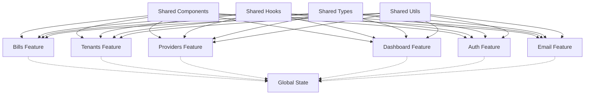

# Architecture Guide

## Table of Contents

1. [Overview](#overview)
2. [Core Principles](#core-principles)
3. [High-Level Architecture](#high-level-architecture)
4. [Feature-Based Structure](#feature-based-structure)
5. [Component Architecture](#component-architecture)
6. [State Management](#state-management)
7. [Data Flow](#data-flow)
8. [Module Dependencies](#module-dependencies)
9. [Import/Export Patterns](#importexport-patterns)
10. [Type Safety](#type-safety)
11. [Performance Considerations](#performance-considerations)
12. [Security Considerations](#security-considerations)
13. [Testing Strategy](#testing-strategy)
14. [Deployment Architecture](#deployment-architecture)

## Overview

The Next Bill Manager application follows a **feature-based architecture** with clear separation of concerns and modular design principles. This architecture ensures maintainability, scalability, and consistency across the codebase.

## Core Principles

1. **Feature Isolation**: Each feature is self-contained with minimal cross-dependencies
2. **Single Responsibility**: Each module has a clear, single purpose
3. **Dependency Inversion**: High-level modules don't depend on low-level modules
4. **Interface Segregation**: Clients depend only on interfaces they use
5. **Open/Closed Principle**: Open for extension, closed for modification
6. **Separation of Concerns**: Each module has a single, well-defined responsibility
7. **Consistency**: Uniform patterns and conventions across the codebase
8. **Maintainability**: Code is easy to understand, modify, and extend
9. **Performance**: Efficient patterns that don't compromise code quality

## High-Level Architecture

The application is structured in three main layers:

```
┌───────────────────────────────────────────────────┐
│                    Presentation Layer             │
│  ┌─────────────┐ ┌─────────────┐ ┌─────────────┐  │
│  │    Pages    │ │  Components │ │   Layouts   │  │
│  └─────────────┘ └─────────────┘ └─────────────┘  │
└───────────────────────────────────────────────────┘
                          │
┌───────────────────────────────────────────────────┐
│                    Feature Layer                  │
│  ┌─────────────┐ ┌─────────────┐ ┌─────────────┐  │
│  │   Bills     │ │  Tenants    │ │  Providers  │  │
│  └─────────────┘ └─────────────┘ └─────────────┘  │
│  ┌─────────────┐ ┌─────────────┐ ┌─────────────┐  │
│  │    Auth     │ │  Dashboard  │ │    Email    │  │
│  └─────────────┘ └─────────────┘ └─────────────┘  │
└───────────────────────────────────────────────────┘
                          │
┌───────────────────────────────────────────────────┐
│                    Infrastructure Layer           │
│  ┌─────────────┐ ┌─────────────┐ ┌─────────────┐  │
│  │   Database  │ │    Auth     │ │    Email    │  │
│  └─────────────┘ └─────────────┘ └─────────────┘  │
└───────────────────────────────────────────────────┘
```

## Feature-Based Structure

### Feature Module Anatomy

Each feature module follows a consistent internal structure:

```
features/[feature-name]/
├── actions/                    # Server actions and API calls
│   ├── index.ts               # Barrel exports
│   ├── create.ts              # Create operations
│   ├── read.ts                # Read operations
│   ├── update.ts              # Update operations
│   └── delete.ts              # Delete operations
├── components/                 # Feature-specific components
│   ├── index.ts               # Barrel exports
│   ├── [component-name].tsx   # React components
│   └── [component-name].test.tsx # Component tests
├── hooks/                      # Feature-specific hooks
│   ├── index.ts               # Barrel exports
│   ├── use-[hook-name].ts     # Custom hooks
│   └── use-[hook-name].test.ts # Hook tests
├── types/                      # Feature-specific types
│   ├── index.ts               # Barrel exports
│   ├── [type-name].ts         # Type definitions
│   └── [type-name].test.ts    # Type validation tests
├── utils/                      # Feature-specific utilities
│   ├── index.ts               # Barrel exports
│   ├── [utility-name].ts      # Utility functions
│   └── [utility-name].test.ts # Utility tests
└── index.ts                    # Feature barrel exports
```

### Best Practices

#### ✅ Do's

```typescript
// ✅ Good: Clear feature structure
features/bills/
├── actions/
│   ├── index.ts
│   ├── createBill.ts
│   └── getBills.ts
├── components/
│   ├── index.ts
│   ├── BillList.tsx
│   └── BillCard.tsx
└── index.ts

// ✅ Good: Proper barrel exports
// features/bills/index.ts
export * from './actions';
export * from './components';
export * from './hooks';
export * from './types';
export * from './utils';
```

#### ❌ Don'ts

```typescript
// ❌ Bad: Mixed concerns in single file
// features/bills/bills.ts
export function createBill() { /* ... */ }
export function BillList() { /* ... */ }
export interface Bill { /* ... */ }

// ❌ Bad: Inconsistent structure
features/bills/
├── billActions.ts
├── billComponents.tsx
└── billTypes.ts
```

## Component Architecture

### Component Hierarchy

```
App
├── Layout
│   ├── Sidebar
│   ├── Header
│   └── Main Content
│       ├── Dashboard Page
│       │   ├── Stats Summary
│       │   ├── Bill Breakdown
│       │   └── Recent Activity
│       ├── Bills Page
│       │   ├── Bill List
│       │   ├── Bill Filters
│       │   └── Bill Actions
│       ├── Tenants Page
│       │   ├── Tenant List
│       │   ├── Tenant Filters
│       │   └── Tenant Actions
│       └── Providers Page
│           ├── Provider List
│           ├── Provider Filters
│           └── Provider Actions
```

### Component Patterns

#### Presentational Components

```typescript
interface PresentationalComponentProps {
  data: ComponentData;
  onAction: (action: Action) => void;
  isLoading?: boolean;
  error?: string;
}

export function PresentationalComponent({
  data,
  onAction,
  isLoading = false,
  error
}: PresentationalComponentProps) {
  if (isLoading) {
    return <ComponentSkeleton />;
  }

  if (error) {
    return <ErrorMessage message={error} />;
  }

  return (
    <div className="component">
      {/* Component content */}
    </div>
  );
}
```

#### Container Components

```typescript
export function ContainerComponent() {
  const { data, isLoading, error, actions } = useFeatureHook();

  return (
    <PresentationalComponent
      data={data}
      onAction={actions.handleAction}
      isLoading={isLoading}
      error={error}
    />
  );
}
```

## State Management

### State Architecture

The application uses a hybrid state management approach:

1. **Local State**: Component-specific state using React hooks
2. **Global State**: Application-wide state using Jotai
3. **Server State**: Data fetched from APIs and cached appropriately

### State Patterns

```typescript
// Local component state
const [isOpen, setIsOpen] = useState(false);

// Global application state
const [user, setUser] = useAtom(userAtom);
const [theme, setTheme] = useAtom(themeAtom);

// Server state with caching
const { data, isLoading, error } = useSWR("/api/bills", fetcher);
```

## Data Flow

### Unidirectional Data Flow

```
User Action → Component → Hook → Action → API → Database
     ↑                                                      ↓
     └─────────────── State Update ←─── Response ←──────────┘
```

### Data Flow Patterns

1. **User interactions** trigger component events
2. **Components** call hooks for data and actions
3. **Hooks** manage state and call server actions
4. **Server actions** handle API calls and data persistence
5. **State updates** flow back to components
6. **UI updates** reflect the new state

## Module Dependencies

### Dependency Rules

1. **Features can depend on shared modules**
2. **Features cannot depend on other features directly**
3. **Shared modules cannot depend on features**
4. **Cross-feature communication through events or shared state**

### Dependency Graph



### Feature Dependencies

```
┌─────────────┐    ┌─────────────┐    ┌─────────────┐
│   Shared    │    │   Shared    │    │   Shared    │
│  Components │    │    Hooks    │    │    Types    │
└─────────────┘    └─────────────┘    └─────────────┘
       │                   │                   │
       └───────────────────┼───────────────────┘
                           │
┌─────────────┐    ┌─────────────┐    ┌─────────────┐
│    Bills    │    │   Tenants   │    │  Providers  │
│   Feature   │    │   Feature   │    │   Feature   │
└─────────────┘    └─────────────┘    └─────────────┘
       │                   │                   │
       └───────────────────┼───────────────────┘
                           │
┌─────────────┐    ┌─────────────┐    ┌─────────────┐
│   Dashboard │    │    Auth     │    │    Email    │
│   Feature   │    │   Feature   │    │   Feature   │
└─────────────┘    └─────────────┘    └─────────────┘
```

## Import/Export Patterns

### Barrel Exports

Use barrel exports (`index.ts`) for clean imports:

```typescript
// features/bills/actions/index.ts
export * from "./createBill";
export * from "./getBills";
export * from "./updateBill";
export * from "./deleteBill";

// features/bills/index.ts
export * from "./actions";
export * from "./components";
export * from "./hooks";
export * from "./types";
export * from "./utils";
```

### Import Guidelines

```typescript
// ✅ Good: Clean imports using barrel exports
import { createBill, getBills } from '@/features/bills';
import { Button, Card } from '@/components/ui';

// ✅ Good: Absolute imports for better maintainability
import { useBills } from '@/features/bills/hooks';
import { BillType } from '@/features/bills/types';

// ❌ Bad: Deep imports
import { createBill } from '@/features/bills/actions/createBill';
import { Button } from '@/components/ui/button';
```

## Type Safety

### TypeScript Configuration

The project uses strict TypeScript configuration with comprehensive type safety features:

```json
{
	"compilerOptions": {
		"exactOptionalPropertyTypes": true,
		"noUncheckedIndexedAccess": true,
		"noImplicitAny": true,
		"noImplicitReturns": true,
		"noImplicitThis": true,
		"noUnusedLocals": true,
		"noUnusedParameters": true,
		"strict": true
	}
}
```

### Runtime Validation System

The application implements a comprehensive runtime validation system using Zod schemas:

```typescript
// Database schemas with strict validation
const TenantDocumentSchema = z.object({
	_id: z.string(),
	userId: z.string(),
	name: z.string().min(1),
	email: z.string().email(),
	phone: z.string().optional(),
	createdAt: z.date(),
	updatedAt: z.date(),
});

// Type inference from schemas
type TenantDocument = z.infer<typeof TenantDocumentSchema>;

// Runtime validation utilities
const validateWithSchema = <T>(
	schema: z.ZodSchema<T>,
	data: unknown,
): { success: true; data: T } | { success: false; error: string } => {
	try {
		const validatedData = schema.parse(data);
		return { success: true, data: validatedData };
	} catch (error) {
		if (error instanceof z.ZodError) {
			return {
				success: false,
				error: error.errors[0]?.message || "Validation failed",
			};
		}
		return { success: false, error: "Unknown validation error" };
	}
};
```

### Type-Safe Utilities

The application provides comprehensive type-safe utilities for common operations:

```typescript
// Safe array operations
export function safeArrayAccess<T>(array: T[], index: number): T | undefined {
	return array[index];
}

// Safe object operations
export function safeObjectAccess<T extends Record<string, unknown>>(
	obj: T,
	key: keyof T,
): T[keyof T] | undefined {
	return obj[key];
}

// Type guards for runtime validation
export const isStringType = (value: unknown): value is string =>
	typeof value === "string";

export const isNumberType = (value: unknown): value is number =>
	typeof value === "number" && !isNaN(value);

export const isObjectType = (
	value: unknown,
): value is Record<string, unknown> =>
	typeof value === "object" && value !== null && !Array.isArray(value);
```

### Performance Optimizations

The type safety system includes performance optimizations:

```typescript
// Type caching for improved performance
export class TypeCache<T> {
	private cache = new Map<string, T>();
	private maxSize: number;

	constructor(maxSize: number = 1000) {
		this.maxSize = maxSize;
	}

	set(key: string, value: T): void {
		if (this.cache.size >= this.maxSize) {
			const firstKey = this.cache.keys().next().value;
			if (firstKey !== undefined) {
				this.cache.delete(firstKey);
			}
		}
		this.cache.set(key, value);
	}

	get(key: string): T | undefined {
		return this.cache.get(key);
	}
}

// Performance measurement utilities
export class PerformanceMeasurer {
	private measurements = new Map<string, number[]>();

	start(operation: string): void {
		const startTime = performance.now();
		this.measurements.set(operation, [startTime]);
	}

	end(operation: string): number {
		const endTime = performance.now();
		const startTimes = this.measurements.get(operation);

		if (startTimes && startTimes.length > 0) {
			const duration = endTime - startTimes[0];
			const durations = this.measurements.get(operation) || [];
			durations.push(duration);
			this.measurements.set(operation, durations);
			return duration;
		}

		return 0;
	}

	getAverage(operation: string): number {
		const durations = this.measurements.get(operation);
		if (!durations || durations.length === 0) return 0;

		return (
			durations.reduce((sum, duration) => sum + duration, 0) / durations.length
		);
	}
}
```

### Error Handling

Structured error handling with type-safe error types:

```typescript
// Error types with discriminated unions
export type ValidationError = {
	type: "validation";
	field: string;
	value: unknown;
	schema: string;
	message: string;
};

export type DatabaseError = {
	type: "database";
	operation: string;
	table: string;
	message: string;
};

export type ApiError = {
	type: "api";
	endpoint: string;
	status: number;
	message: string;
};

export type AppError = ValidationError | DatabaseError | ApiError;

// Error factories
export function createValidationError(
	message: string,
	field: string,
	value: unknown,
	schema: string,
): ValidationError {
	return {
		type: "validation",
		field,
		value,
		schema,
		message,
	};
}

// Safe execution utilities
export async function safeExecuteAsync<T>(
	fn: () => Promise<T>,
): Promise<{ success: true; data: T } | { success: false; error: AppError }> {
	try {
		const result = await fn();
		return { success: true, data: result };
	} catch (error) {
		return { success: false, error: error as AppError };
	}
}
```

### Form Validation

Type-safe form validation with React Hook Form integration:

```typescript
// Form validation utilities
export function validateFormData<T>(
	schema: z.ZodSchema<T>,
	data: unknown,
): FormValidationResult<T> {
	try {
		const validatedData = schema.parse(data);
		return {
			isValid: true,
			data: validatedData,
		};
	} catch (error) {
		if (error instanceof z.ZodError) {
			const errors: Record<string, string> = {};
			error.errors.forEach((err) => {
				const path = err.path.join(".");
				errors[path] = err.message;
			});
			return {
				isValid: false,
				errors,
			};
		}
		return {
			isValid: false,
			errors: { general: "Validation failed" },
		};
	}
}

// React Hook Form integration
const UserFormSchema = z.object({
	name: z.string().min(1, "Name is required"),
	email: z.string().email("Invalid email format"),
	role: z.enum(["admin", "user", "manager"]),
});

type UserFormData = z.infer<typeof UserFormSchema>;

function UserForm() {
	const {
		register,
		handleSubmit,
		formState: { errors },
	} = useForm<UserFormData>({
		resolver: zodResolver(UserFormSchema),
	});

	const onSubmit = async (data: UserFormData) => {
		const validation = validateFormData(UserFormSchema, data);
		if (!validation.success) {
			console.error("Form validation failed:", validation.error);
			return;
		}
		await createUser(validation.data);
	};
}
```

### Key Benefits

- **Zero TypeScript Errors**: Strict configuration with comprehensive type definitions
- **Runtime Validation**: Zod schemas ensure data integrity at runtime
- **Performance Optimized**: Caching and lazy evaluation for better performance
- **Type-Safe Utilities**: Safe operations for arrays, objects, and common patterns
- **Structured Error Handling**: Discriminated unions for error types
- **Form Integration**: Seamless integration with React Hook Form
- **Database Safety**: Type-safe database operations with schema validation

## Performance Considerations

### Optimization Strategies

1. **Code Splitting**: Automatic code splitting with Next.js
2. **Lazy Loading**: Dynamic imports for large components
3. **Memoization**: React.memo and useMemo for expensive operations
4. **Bundle Optimization**: Tree shaking and dead code elimination
5. **Image Optimization**: Next.js Image component for optimized images
6. **Caching**: SWR for data caching and revalidation

### Performance Patterns

```typescript
// ✅ Good: Lazy loading large components
const HeavyComponent = lazy(() => import("./HeavyComponent"));

// ✅ Good: Memoization for expensive operations
const expensiveValue = useMemo(() => {
	return computeExpensiveValue(data);
}, [data]);

// ✅ Good: Optimized re-renders
const MemoizedComponent = memo(ExpensiveComponent);
```

## Security Considerations

### Security Measures

1. **Authentication**: NextAuth.js for secure authentication
2. **Authorization**: Role-based access control
3. **Input Validation**: Zod schemas for data validation
4. **SQL Injection Prevention**: Parameterized queries
5. **XSS Prevention**: Content sanitization
6. **CSRF Protection**: Built-in Next.js protection
7. **Environment Variables**: Secure configuration management

### Security Patterns

```typescript
// ✅ Good: Content sanitization
import DOMPurify from "dompurify";

// ✅ Good: Input validation with Zod
const createBillSchema = z.object({
	title: z.string().min(1).max(100),
	amount: z.number().positive(),
	dueDate: z.date(),
	tenantId: z.string().uuid(),
	providerId: z.string().uuid(),
});

const sanitizedContent = DOMPurify.sanitize(userInput);
```

## Testing Strategy

### Testing Pyramid

1. **Unit Tests**: Individual functions and components
2. **Integration Tests**: Feature interactions
3. **End-to-End Tests**: Complete user workflows

### Testing Patterns

```typescript
// ✅ Good: Component testing
describe('BillCard', () => {
  it('renders bill information correctly', () => {
    const bill = mockBill();
    render(<BillCard bill={bill} />);
    expect(screen.getByText(bill.title)).toBeInTheDocument();
  });
});

// ✅ Good: Hook testing
describe('useBills', () => {
  it('fetches bills successfully', async () => {
    const { result } = renderHook(() => useBills());
    await waitFor(() => {
      expect(result.current.data).toBeDefined();
    });
  });
});
```

## Deployment Architecture

### Deployment Strategy

1. **Platform**: Vercel for Next.js optimization
2. **Database**: MongoDB Atlas for managed database
3. **Authentication**: NextAuth.js with secure providers
4. **Email**: Gmail API for email services
5. **Monitoring**: Built-in Vercel analytics
6. **CI/CD**: Automated deployment pipeline

### Environment Configuration

```env
# Production Environment
NODE_ENV=production
MONGODB_URI=production_mongodb_uri
NEXTAUTH_SECRET=production_secret
NEXTAUTH_URL=https://your-domain.com
GMAIL_CLIENT_ID=production_gmail_client_id
GMAIL_CLIENT_SECRET=production_gmail_client_secret
GMAIL_REFRESH_TOKEN=production_gmail_refresh_token
```

### Deployment Pipeline

1. **Code Push**: Triggers automated build
2. **Validation**: Runs all validation scripts
3. **Testing**: Executes test suite
4. **Build**: Creates optimized production build
5. **Deployment**: Deploys to Vercel
6. **Verification**: Health checks and monitoring

---

This architecture ensures the Next Bill Manager application is maintainable, scalable, and follows industry best practices for modern web development.
