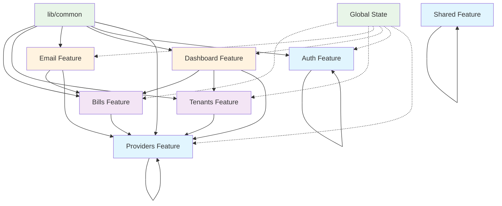

# Architecture Guide

## Overview

The Next Bill Manager application follows a feature-based architecture with clear separation of concerns.

## Core Principles

1. **Feature Isolation**: Each feature is self-contained
2. **Single Responsibility**: Each module has a clear purpose
3. **Dependency Inversion**: High-level modules don't depend on low-level modules
4. **Separation of Concerns**: Each module has a single responsibility

## High-Level Architecture

The application is structured in three main layers:

```
┌───────────────────────────────────────────────────┐
│                 Presentation Layer                │
│  ┌─────────────┐ ┌─────────────┐ ┌─────────────┐  │
│  │    Pages    │ │  Components │ │   Layouts   │  │
│  └─────────────┘ └─────────────┘ └─────────────┘  │
└───────────────────────────────────────────────────┘
                          │
┌───────────────────────────────────────────────────┐
│                   Feature Layer                   │
│  ┌─────────────┐ ┌─────────────┐ ┌─────────────┐  │
│  │   Bills     │ │  Tenants    │ │  Providers  │  │
│  └─────────────┘ └─────────────┘ └─────────────┘  │
│  ┌─────────────┐ ┌─────────────┐ ┌─────────────┐  │
│  │    Auth     │ │  Dashboard  │ │    Email    │  │
│  └─────────────┘ └─────────────┘ └─────────────┘  │
└───────────────────────────────────────────────────┘
                          │
┌───────────────────────────────────────────────────┐
│                Infrastructure Layer               │
│  ┌─────────────┐ ┌─────────────┐ ┌─────────────┐  │
│  │   Database  │ │    Auth     │ │    Email    │  │
│  └─────────────┘ └─────────────┘ └─────────────┘  │
└───────────────────────────────────────────────────┘
```

## Feature Structure

Each feature follows this structure:

```
features/[feature-name]/
├── actions/                    	# Server actions and API calls
│   ├── index.ts                	# Barrel exports
│   ├── create.ts               	# Create operations
│   ├── read.ts                 	# Read operations
│   ├── update.ts               	# Update operations
│   └── delete.ts               	# Delete operations
├── components/                 	# Feature-specific components
│   ├── index.ts                	# Barrel exports
│   ├── [component-name].tsx    	# React components
│   └── [component-name].test.tsx # Component tests
├── hooks/                     		# Feature-specific hooks
│   ├── index.ts               		# Barrel exports
│   ├── use-[hook-name].ts     		# Custom hooks
│   └── use-[hook-name].test.ts		# Hook tests
├── types/                     		# Feature-specific types
│   ├── index.ts               		# Barrel exports
│   ├── [type-name].ts         		# Type definitions
│   └── [type-name].test.ts    		# Type validation tests
├── utils/                     		# Feature-specific utilities
│   ├── index.ts               		# Barrel exports
│   ├── [utility-name].ts      		# Utility functions
│   └── [utility-name].test.ts 		# Utility tests
└── index.ts                   		# Feature barrel exports
```

## Component Architecture

### Component Hierarchy

```
App
├── Layout
│   ├── Sidebar
│   ├── Header
│   └── Main Content
│       ├── Dashboard Page
│       ├── Bills Page
│       ├── Tenants Page
│       └── Providers Page
```

### Component Patterns

#### Presentational Components

```typescript
interface PresentationalComponentProps {
  data: ComponentData;
  onAction: (action: Action) => void;
  isLoading?: boolean;
  error?: string;
}

export function PresentationalComponent({
  data,
  onAction,
  isLoading = false,
  error
}: PresentationalComponentProps) {
  if (isLoading) return <ComponentSkeleton />;
  if (error) return <ErrorMessage message={error} />;

  return (
    <div className="component">
      {/* Component content */}
    </div>
  );
}
```

#### Container Components

```typescript
export function ContainerComponent() {
  const { data, isLoading, error, actions } = useFeatureHook();

  return (
    <PresentationalComponent
      data={data}
      onAction={actions.handleAction}
      isLoading={isLoading}
      error={error}
    />
  );
}
```

## State Management

The application uses a hybrid state management approach:

1. **Local State**: Component-specific state using React hooks
2. **Global State**: Application-wide state using Jotai
3. **Server State**: Data fetched from APIs and cached appropriately

```typescript
// Local component state
const [isOpen, setIsOpen] = useState(false);

// Global application state
const [user, setUser] = useAtom(userAtom);

// Server state with caching
const { data, isLoading, error } = useSWR("/api/bills", fetcher);
```

## Data Flow

### Unidirectional Data Flow

```
User Action → Component → Hook → Action → API → Database
     ↑                                              ↓
     └─────── State Update ←─── Response ←──────────┘
```

## Module Dependencies

### Dependency Rules

1. **Features can depend on shared modules**
2. **Features cannot depend on other features directly**
3. **Shared modules cannot depend on features**
4. **Cross-feature communication through events or shared state**

### Dependency Graph

The application follows a layered dependency structure:



### Feature Hierarchy

**Base Features (No Dependencies):**

- **Auth**: User authentication and session management
- **Providers**: Utility provider definitions and categories
- **Shared**: Common utilities, hooks, and types

**Level 1 Features (Depend on Base):**

- **Bills**: Bill management and processing (depends on Providers)
- **Tenants**: Tenant management and share calculations (depends on Providers)

**Level 2 Features (Depend on Level 1 and Base):**

- **Email**: Email processing and Gmail integration (depends on Bills, Providers)
- **Dashboard**: Analytics and data visualization (depends on Bills, Tenants, Providers)

## Import/Export Patterns

### Barrel Exports

Use barrel exports (`index.ts`) for clean imports:

```typescript
// features/bills/actions/index.ts
export * from "./createBill";
export * from "./getBills";
export * from "./updateBill";
export * from "./deleteBill";

// features/bills/index.ts
export * from "./actions";
export * from "./components";
export * from "./hooks";
export * from "./types";
export * from "./utils";
```

### Import Guidelines

```typescript
// Clean imports using barrel exports
import { Button, Card } from "@/components/ui";
import { createBill, getBills } from "@/features/bills";
// Absolute imports for better maintainability
import { useBills } from "@/features/bills/hooks";
import { BillType } from "@/features/bills/types";
```

## Type Safety

The application implements comprehensive type safety with strict TypeScript configuration, runtime validation using Zod schemas, and type-safe utilities.

For detailed information about the type safety system, see the [Type Safety Guide](TYPE_SAFETY_GUIDE.md).

## Performance Considerations

### Optimization Strategies

1. **Code Splitting**: Automatic code splitting with Next.js
2. **Lazy Loading**: Dynamic imports for large components
3. **Memoization**: React.memo and useMemo for expensive operations
4. **Bundle Optimization**: Tree shaking and dead code elimination
5. **Caching**: SWR for data caching and revalidation

### Performance Patterns

```typescript
// Lazy loading large components
const HeavyComponent = lazy(() => import("./HeavyComponent"));

// Memoization for expensive operations
const expensiveValue = useMemo(() => {
	return computeExpensiveValue(data);
}, [data]);

// Optimized re-renders
const MemoizedComponent = memo(ExpensiveComponent);
```

## Security Considerations

### Security Measures

1. **Authentication**: NextAuth.js for secure authentication
2. **Authorization**: Role-based access control
3. **Input Validation**: Zod schemas for data validation
4. **SQL Injection Prevention**: Parameterized queries
5. **XSS Prevention**: Content sanitization
6. **CSRF Protection**: Built-in Next.js protection

### Security Patterns

```typescript
// Content sanitization
import DOMPurify from "dompurify";

// Input validation with Zod
const createBillSchema = z.object({
	title: z.string().min(1).max(100),
	amount: z.number().positive(),
	dueDate: z.date(),
	tenantId: z.string().uuid(),
	providerId: z.string().uuid(),
});

const sanitizedContent = DOMPurify.sanitize(userInput);
```

## Testing Strategy

### Testing Pyramid

1. **Unit Tests**: Individual functions and components
2. **Integration Tests**: Feature interactions
3. **End-to-End Tests**: Complete user workflows

### Testing Patterns

```typescript
// Component testing
describe('BillCard', () => {
  it('renders bill information correctly', () => {
    const bill = mockBill();
    render(<BillCard bill={bill} />);
    expect(screen.getByText(bill.title)).toBeInTheDocument();
  });
});

// Hook testing
describe('useBills', () => {
  it('fetches bills successfully', async () => {
    const { result } = renderHook(() => useBills());
    await waitFor(() => {
      expect(result.current.data).toBeDefined();
    });
  });
});
```

## Deployment Architecture

### Deployment Strategy

1. **Platform**: Vercel for Next.js optimization
2. **Database**: MongoDB Atlas for managed database
3. **Authentication**: NextAuth.js with secure providers
4. **Email**: Gmail API for email services
5. **Monitoring**: Built-in Vercel analytics
6. **CI/CD**: Automated deployment pipeline

### Environment Configuration

```env
# Production Environment
NODE_ENV=production
MONGODB_URI=production_mongodb_uri
NEXTAUTH_SECRET=production_secret
NEXTAUTH_URL=https://your-domain.com
GMAIL_CLIENT_ID=production_gmail_client_id
GMAIL_CLIENT_SECRET=production_gmail_client_secret
```

### Deployment Pipeline

1. **Code Push**: Triggers automated build
2. **Validation**: Runs all validation scripts
3. **Testing**: Executes test suite
4. **Build**: Creates optimized production build
5. **Deployment**: Deploys to Vercel
6. **Verification**: Health checks and monitoring
