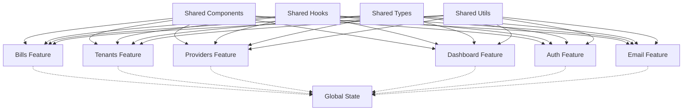

# Code Organization Documentation

## Table of Contents

1. [Architecture Overview](#architecture-overview)
2. [Feature-Based Structure](#feature-based-structure)
3. [Module Dependencies](#module-dependencies)
4. [Component Architecture](#component-architecture)
5. [State Management](#state-management)
6. [Data Flow](#data-flow)
7. [Testing Strategy](#testing-strategy)
8. [Performance Considerations](#performance-considerations)
9. [Security Considerations](#security-considerations)
10. [Deployment Architecture](#deployment-architecture)

## Architecture Overview

The Next Bill Manager application follows a **feature-based architecture** with clear separation of concerns and modular design principles.

### Core Principles

1. **Feature Isolation**: Each feature is self-contained with minimal cross-dependencies
2. **Single Responsibility**: Each module has a clear, single purpose
3. **Dependency Inversion**: High-level modules don't depend on low-level modules
4. **Interface Segregation**: Clients depend only on interfaces they use
5. **Open/Closed Principle**: Open for extension, closed for modification

### High-Level Architecture

```
┌─────────────────────────────────────────────────────────────┐
│                    Presentation Layer                       │
│  ┌─────────────┐ ┌─────────────┐ ┌─────────────┐          │
│  │   Pages     │ │ Components  │ │   Layouts   │          │
│  └─────────────┘ └─────────────┘ └─────────────┘          │
└─────────────────────────────────────────────────────────────┘
                              │
┌─────────────────────────────────────────────────────────────┐
│                    Feature Layer                            │
│  ┌─────────────┐ ┌─────────────┐ ┌─────────────┐          │
│  │   Bills     │ │  Tenants    │ │  Providers  │          │
│  └─────────────┘ └─────────────┘ └─────────────┘          │
│  ┌─────────────┐ ┌─────────────┐ ┌─────────────┐          │
│  │   Auth      │ │  Dashboard  │ │   Email     │          │
│  └─────────────┘ └─────────────┘ └─────────────┘          │
└─────────────────────────────────────────────────────────────┘
                              │
┌─────────────────────────────────────────────────────────────┐
│                    Infrastructure Layer                     │
│  ┌─────────────┐ ┌─────────────┐ ┌─────────────┐          │
│  │   Database  │ │   Auth      │ │   Email     │          │
│  └─────────────┘ └─────────────┘ └─────────────┘          │
└─────────────────────────────────────────────────────────────┘
```

## Feature-Based Structure

### Feature Module Anatomy

Each feature module follows a consistent internal structure:

```
features/[feature-name]/
├── actions/                    # Server actions and API calls
│   ├── index.ts               # Barrel exports
│   ├── create.ts              # Create operations
│   ├── read.ts                # Read operations
│   ├── update.ts              # Update operations
│   └── delete.ts              # Delete operations
├── components/                 # Feature-specific components
│   ├── index.ts               # Barrel exports
│   ├── [component-name].tsx   # React components
│   └── [component-name].test.tsx # Component tests
├── hooks/                      # Feature-specific hooks
│   ├── index.ts               # Barrel exports
│   ├── use-[hook-name].ts     # Custom hooks
│   └── use-[hook-name].test.ts # Hook tests
├── types/                      # Feature-specific types
│   ├── index.ts               # Barrel exports
│   ├── [type-name].ts         # Type definitions
│   └── [type-name].test.ts    # Type validation tests
├── utils/                      # Feature-specific utilities
│   ├── index.ts               # Barrel exports
│   ├── [utility-name].ts      # Utility functions
│   └── [utility-name].test.ts # Utility tests
└── index.ts                    # Feature barrel exports
```

### Feature Dependencies

```
┌─────────────┐    ┌─────────────┐    ┌─────────────┐
│   Shared    │    │   Shared    │    │   Shared    │
│  Components │    │    Hooks    │    │    Types    │
└─────────────┘    └─────────────┘    └─────────────┘
       │                   │                   │
       └───────────────────┼───────────────────┘
                           │
┌─────────────┐    ┌─────────────┐    ┌─────────────┐
│    Bills    │    │   Tenants   │    │  Providers  │
│   Feature   │    │   Feature   │    │   Feature   │
└─────────────┘    └─────────────┘    └─────────────┘
       │                   │                   │
       └───────────────────┼───────────────────┘
                           │
┌─────────────┐    ┌─────────────┐    ┌─────────────┐
│   Dashboard │    │    Auth     │    │    Email    │
│   Feature   │    │   Feature   │    │   Feature   │
└─────────────┘    └─────────────┘    └─────────────┘
```

## Module Dependencies

### Dependency Rules

1. **Features can depend on shared modules**
2. **Features cannot depend on other features directly**
3. **Shared modules cannot depend on features**
4. **Cross-feature communication through events or shared state**

### Dependency Graph



## Component Architecture

### Component Hierarchy

```
App
├── Layout
│   ├── Sidebar
│   ├── Header
│   └── Main Content
│       ├── Dashboard Page
│       │   ├── Stats Summary
│       │   ├── Bill Breakdown
│       │   └── Recent Activity
│       ├── Bills Page
│       │   ├── Bill List
│       │   ├── Bill Filters
│       │   └── Bill Actions
│       ├── Tenants Page
│       │   ├── Tenant List
│       │   ├── Tenant Filters
│       │   └── Tenant Actions
│       └── Providers Page
│           ├── Provider List
│           ├── Provider Filters
│           └── Provider Actions
```

### Component Patterns

#### Presentational Components

```typescript
interface PresentationalComponentProps {
  data: ComponentData;
  onAction: (action: Action) => void;
  isLoading?: boolean;
  error?: string;
}

export function PresentationalComponent({
  data,
  onAction,
  isLoading = false,
  error
}: PresentationalComponentProps) {
  if (isLoading) return <LoadingSpinner />;
  if (error) return <ErrorMessage message={error} />;

  return (
    <div>
      {/* Component implementation */}
    </div>
  );
}
```

#### Container Components

```typescript
export function ContainerComponent() {
  const { data, isLoading, error, actions } = useFeatureHook();

  return (
    <PresentationalComponent
      data={data}
      onAction={actions.handleAction}
      isLoading={isLoading}
      error={error}
    />
  );
}
```

## State Management

### State Architecture

```
┌─────────────────────────────────────────────────────────────┐
│                    Global State                             │
│  ┌─────────────┐ ┌─────────────┐ ┌─────────────┐          │
│  │   User      │ │   App       │ │   UI        │          │
│  │   State     │ │   State     │ │   State     │          │
│  └─────────────┘ └─────────────┘ └─────────────┘          │
└─────────────────────────────────────────────────────────────┘
                              │
┌─────────────────────────────────────────────────────────────┐
│                    Feature State                            │
│  ┌─────────────┐ ┌─────────────┐ ┌─────────────┐          │
│  │   Bills     │ │  Tenants    │ │  Providers  │          │
│  │   State     │ │   State     │ │   State     │          │
│  └─────────────┘ └─────────────┘ └─────────────┘          │
└─────────────────────────────────────────────────────────────┘
                              │
┌─────────────────────────────────────────────────────────────┐
│                    Local State                              │
│  ┌─────────────┐ ┌─────────────┐ ┌─────────────┐          │
│  │ Component   │ │ Component   │ │ Component   │          │
│  │   State     │ │   State     │ │   State     │          │
│  └─────────────┘ └─────────────┘ └─────────────┘          │
└─────────────────────────────────────────────────────────────┘
```

### State Management Patterns

#### Global State

```typescript
// Global state for user authentication
interface UserState {
	user: User | null;
	isAuthenticated: boolean;
	isLoading: boolean;
}

// Global state for application settings
interface AppState {
	theme: "light" | "dark";
	language: string;
	notifications: Notification[];
}
```

#### Feature State

```typescript
// Feature-specific state
interface BillsState {
	bills: Bill[];
	selectedBill: Bill | null;
	filters: BillFilters;
	isLoading: boolean;
	error: string | null;
}
```

#### Local State

```typescript
// Component-specific state
const [isDialogOpen, setIsDialogOpen] = useState(false);
const [formData, setFormData] = useState<FormData>({});
const [validationErrors, setValidationErrors] = useState<string[]>([]);
```

## Data Flow

### Unidirectional Data Flow

```
┌─────────────┐    ┌─────────────┐    ┌─────────────┐
│   User      │───▶│   Action    │───▶│   State     │
│   Action    │    │   Dispatcher│    │   Store     │
└─────────────┘    └─────────────┘    └─────────────┘
                           │                   │
                           ▼                   ▼
┌─────────────┐    ┌─────────────┐    ┌─────────────┐
│   Component │◀───│   Selector  │◀───│   State     │
│   Render    │    │   Function  │    │   Update    │
└─────────────┘    └─────────────┘    └─────────────┘
```

### Data Flow Example

```typescript
// 1. User triggers action
const handleCreateBill = async (billData: CreateBillData) => {
  try {
    setIsLoading(true);
    const newBill = await createBill(billData);
    setBills(prev => [...prev, newBill]);
    toast.success('Bill created successfully');
  } catch (error) {
    toast.error('Failed to create bill');
  } finally {
    setIsLoading(false);
  }
};

// 2. Action updates state
const createBill = async (data: CreateBillData): Promise<Bill> => {
  const response = await fetch('/api/bills', {
    method: 'POST',
    headers: { 'Content-Type': 'application/json' },
    body: JSON.stringify(data)
  });

  if (!response.ok) {
    throw new Error('Failed to create bill');
  }

  return response.json();
};

// 3. Component re-renders with new state
function BillsList({ bills, isLoading }: BillsListProps) {
  if (isLoading) return <LoadingSpinner />;

  return (
    <div>
      {bills.map(bill => (
        <BillCard key={bill.id} bill={bill} />
      ))}
    </div>
  );
}
```

## Testing Strategy

### Testing Pyramid

```
        /\
       /  \     E2E Tests (Few)
      /____\
     /      \   Integration Tests (Some)
    /________\
   /          \ Unit Tests (Many)
  /____________\
```

### Test Organization

```
src/
├── __tests__/                    # Global test utilities
├── features/
│   └── [feature]/
│       ├── __tests__/            # Feature-specific tests
│       │   ├── components/       # Component tests
│       │   ├── hooks/           # Hook tests
│       │   ├── utils/           # Utility tests
│       │   └── integration/     # Integration tests
│       └── ...
└── ...
```

### Testing Patterns

#### Unit Tests

```typescript
// Component test
describe('BillCard', () => {
  it('renders bill information correctly', () => {
    const bill = mockBill();
    render(<BillCard bill={bill} />);

    expect(screen.getByText(bill.title)).toBeInTheDocument();
    expect(screen.getByText(bill.amount)).toBeInTheDocument();
  });

  it('calls onEdit when edit button is clicked', () => {
    const onEdit = jest.fn();
    const bill = mockBill();

    render(<BillCard bill={bill} onEdit={onEdit} />);

    fireEvent.click(screen.getByRole('button', { name: /edit/i }));
    expect(onEdit).toHaveBeenCalledWith(bill.id);
  });
});
```

#### Integration Tests

```typescript
// Feature integration test
describe('Bills Feature', () => {
  it('creates a new bill successfully', async () => {
    render(<BillsPage />);

    // Fill form
    fireEvent.change(screen.getByLabelText(/title/i), {
      target: { value: 'Test Bill' }
    });

    // Submit form
    fireEvent.click(screen.getByRole('button', { name: /create/i }));

    // Verify success
    await waitFor(() => {
      expect(screen.getByText('Bill created successfully')).toBeInTheDocument();
    });
  });
});
```

## Performance Considerations

### Optimization Strategies

1. **Code Splitting**

   - Route-based code splitting
   - Component-based code splitting
   - Dynamic imports for heavy components

2. **Memoization**

   - React.memo for components
   - useMemo for expensive calculations
   - useCallback for function references

3. **Bundle Optimization**

   - Tree shaking
   - Dead code elimination
   - Vendor chunk separation

4. **Caching**
   - API response caching
   - Component state caching
   - Browser caching strategies

### Performance Monitoring

```typescript
// Performance monitoring setup
const performanceObserver = new PerformanceObserver((list) => {
	for (const entry of list.getEntries()) {
		if (entry.entryType === "measure") {
			console.log(`${entry.name}: ${entry.duration}ms`);
		}
	}
});

performanceObserver.observe({ entryTypes: ["measure"] });
```

## Security Considerations

### Security Measures

1. **Authentication & Authorization**

   - JWT token management
   - Role-based access control
   - Session management

2. **Data Validation**

   - Input sanitization
   - Type validation
   - Schema validation

3. **API Security**

   - CORS configuration
   - Rate limiting
   - Request validation

4. **Client-Side Security**
   - XSS prevention
   - CSRF protection
   - Secure storage

### Security Implementation

```typescript
// Input validation
const validateBillData = (data: unknown): data is CreateBillData => {
	return (
		typeof data === "object" &&
		data !== null &&
		"title" in data &&
		"amount" in data &&
		typeof (data as any).title === "string" &&
		typeof (data as any).amount === "number"
	);
};

// API security middleware
const withAuth = (handler: NextApiHandler): NextApiHandler => {
	return async (req, res) => {
		const token = req.headers.authorization?.replace("Bearer ", "");

		if (!token) {
			return res.status(401).json({ error: "Unauthorized" });
		}

		try {
			const user = await verifyToken(token);
			req.user = user;
			return handler(req, res);
		} catch (error) {
			return res.status(401).json({ error: "Invalid token" });
		}
	};
};
```

## Deployment Architecture

### Deployment Pipeline

```
┌─────────────┐    ┌─────────────┐    ┌─────────────┐    ┌─────────────┐
│   Source    │───▶│   Build     │───▶│   Test      │───▶│   Deploy    │
│   Code      │    │   Process   │    │   Suite     │    │   Process   │
└─────────────┘    └─────────────┘    └─────────────┘    └─────────────┘
```

### Environment Configuration

```typescript
// Environment-specific configuration
const config = {
	development: {
		apiUrl: "http://localhost:3000/api",
		databaseUrl: "mongodb://localhost:27017/dev",
		authSecret: "dev-secret",
	},
	production: {
		apiUrl: process.env.API_URL,
		databaseUrl: process.env.DATABASE_URL,
		authSecret: process.env.AUTH_SECRET,
	},
};

export const getConfig = () => {
	const environment = process.env.NODE_ENV || "development";
	return config[environment as keyof typeof config];
};
```

### Monitoring and Logging

```typescript
// Application monitoring
const logger = {
  info: (message: string, data?: any) => {
    console.log(`[INFO] ${message}`, data);
  },
  error: (message: string, error?: Error) => {
    console.error(`[ERROR] ${message}`, error);
  },
  warn: (message: string, data?: any) => {
    console.warn(`[WARN] ${message}`, data);
  }
};

// Error boundary for React components
class ErrorBoundary extends React.Component {
  componentDidCatch(error: Error, errorInfo: React.ErrorInfo) {
    logger.error('Component error', error);
    // Send error to monitoring service
  }

  render() {
    if (this.state.hasError) {
      return <ErrorFallback />;
    }

    return this.props.children;
  }
}
```

## Conclusion

This documentation provides a comprehensive overview of the code organization architecture for the Next Bill Manager application. The feature-based structure ensures maintainability, scalability, and clear separation of concerns while following modern React and Next.js best practices.

For more detailed information about specific aspects, refer to the individual feature documentation and the code organization guidelines.
